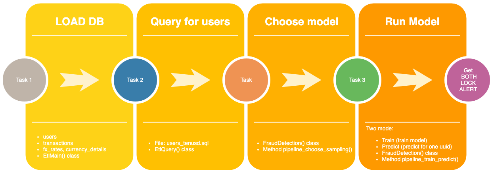
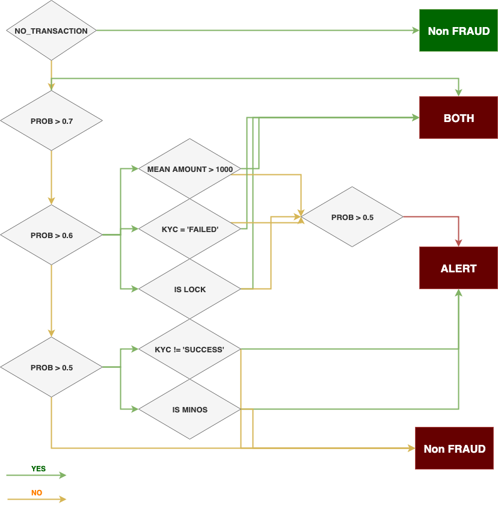

# FraudDetection

## Run

Run all with default config

```sh
python3 main.py --type all 
```

* run task_1 **load_db**
* run task_2 **query for first transactions of users**
* run task_3 **train and predict model Random Forest** (with default uuid = `44bd7ca5-7a84-41d8-a206-1a307067393c`)

## Command Line

```sh
python3 main.py -h
usage: main.py [-h] [-u UUID] [-t {all,load_db,model}]

Fraud Detection and DB load tasks

optional arguments:
  -h, --help            show this help message and exit
  -u UUID, --uuid UUID  UUID for predict
  -t {all,load_db,model}, --type {all,load_db,model}
                        Type of run
```

## Structure

* **Config:** [config/config.yaml](config/config.yaml). All information about log, model, table.
* **Report:** report with EDA, Model analysis (report/report.ipynb)
* **data:** forlder with data
* **output:** forlder with model (model.pkl, columns.pkl, scaler.pkl)
* **src:**
	* **etl:** code for etl task
	* **model:** code for model (preprocessing, visualization, class for train/eval model)
	* **SQL**: query files

## Main pipelines


## Configuration

Default configuration  [config/config.yaml](config/config.yaml). 
If you don't need to see log, you should change `log: False`

### Config model

* If you need only predict (for uuid), you should fix `mode: predict`.
* This data with unbalanced class. And you can use three options of sampling:
	* **under:** RandomUnderSampling()
	* **smote:**  SMOTE()
	* **combine** SMOTEENN()


```yml
model:
  mode: train
  files:
    model: 'model.pkl'
    columns: 'column.pkl'
    scaler: 'scaler.pkl'
  data_value:
    test_size: 0.2
    features_not_dummy: ['created_date', 'birth_year', 'has_email',
                         'source_minos', 'first_success',
                         'country_gb', 'diff_date', 'has_transactions', 'cnt_currency']
    features_dummy: ['terms_version', 'type_freq', 'state_freq', 'kyc']
    label: ['is_fraudster']
    na:
      terms_version: '2000-01-01'
      default: -1
  fit_value:
    n_splits: 10
    model: 'RF'
    sampling: 'combine'
    params:
      criterion: entropy
      min_samples_leaf: 3
      n_estimators: 10
```


### Config table

* Mode `insert_all: True`. If true then ignore all value in [tables][users][insert] 
* `file`: file with data
* `columns`: columns of table
* `files_sql`: files for query

```yaml
insert_all: True
tables:
  users:
    file: 'train_users.csv'
    extra_file: 'train_fraudsters.csv'
    insert: False
    columns: ['id',
              'has_email',
              'phone_country',
              'is_fraudster',
              'terms_version',
              'created_date',
              'state',
              'country',
              'birth_year',
              'kyc',
              'failed_sign_in_attempts']
              'rate']
files_sql:
  users_tenusd: 'users_tenusd.sql'
```


## Constants

* Chunksize for read_csv and insert to tables dataframe
```yml
CHUNK_SIZE: 10 ** 5
```
* Paths:

```yaml
PATH_DATA: os.path.join(ROOT, 'data/')
PATH_SQL: os.path.join(ROOT, 'src/SQL/')
PATH_OUT: os.path.join(ROOT, 'output/')
PATH_CFG: os.path.join(ROOT, 'config/config.yaml')
```

* Database config:

```yaml
DATABASE_URI: "postgresql://localhost:5432/fraud"
```
You need to change this.

## Model output



